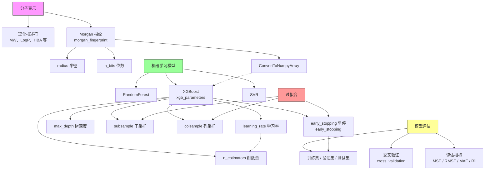

# 概念笔记

> 每个概念一篇完整讲解，按主题分类，底部附相关概念链接，形成网状知识结构。

---

## 概念地图



> 粉色：分子表示 | 绿色：模型 | 黄色：评估 | 红色：核心问题

---

## 按主题分类

### 分子表示

| 概念 | 一句话 |
|------|--------|
| [Morgan 分子指纹](morgan_fingerprint.md) | 把分子结构编码成 0/1 数组，用于机器学习 |

### 模型与调参

| 概念 | 一句话 |
|------|--------|
| [XGBoost 参数详解](xgb_parameters.md) | 每个参数调大调小的影响、参数间互相关系、调参顺序 |
| [早停机制](early_stopping.md) | 监控验证集性能，连续 N 轮没提升就停，防止过拟合 |

---

## 阅读路径建议

按从基础到进阶的顺序：

```
分子描述符 → Morgan 指纹
                ↓
          机器学习基础 → 交叉验证
                ↓
          XGBoost 参数 → 早停机制
```

---

## 说明

- 每个概念笔记底部都有"相关概念"链接，可跳转阅读
- 概念图持续更新，学到新概念往里加
- 文件名即主题，英文小写，下划线分隔
